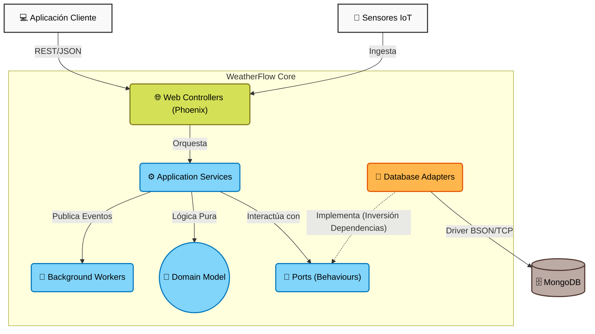

# Arquitectura del Sistema

WeatherFlow está diseñado utilizando la **Arquitectura Hexagonal** (Ports and Adapters) y principios de **Domain-Driven Design (DDD)**. 

Este diseño promueve el desacoplamiento entre las reglas de negocio de nuestro dominio meteorológico y los detalles de infraestructura técnica como bases de datos, APIs y frameworks web.

## Diagrama de Componentes

A continuación se ilustra la arquitectura general del sistema en un Diagrama C4 a nivel de componentes:

## Flujo de Datos y Capas
1. **Adaptadores de Entrada (Capa Web):** Los controladores de Phoenix reciben las peticiones HTTP. No contienen lógica de negocio; solo transforman el JSON a estructuras básicas y delegan al servicio de aplicación correspondiente.
2. **Servicios de Aplicación:** Coordinan las acciones necesarias. Solicitan datos a los repositorios, los convierten en entidades puras de dominio, ejecutan la lógica de negocio y guardan los resultados actualizados. Son el punto de entrada principal a nuestra aplicación real.
3. **Dominio Puro:** Es el corazón del sistema (`User`, `Station`, `Telemetry`, `Alert`). Todo aquí son estructuras y funciones inmutables de Elixir sin efectos secundarios. No conocen de HTTP, ni de MongoDB.
4. **Puertos (Behaviours):** Actúan como contratos (`@callbacks`) que exigen a la capa de infraestructura proveer ciertos métodos (`insert`, `get_by_id`, etc). Esto nos permite hacer *Dependency Injection* fácilmente durante los tests (Mocks).
5. **Adaptadores de Salida (Capa de Infraestructura):** Implementan los puertos definidos interactuando directamente con el Driver nativo de MongoDB Atlas, gestionando las conversiones entre Documentos BSON y Entidades de Elixir.
