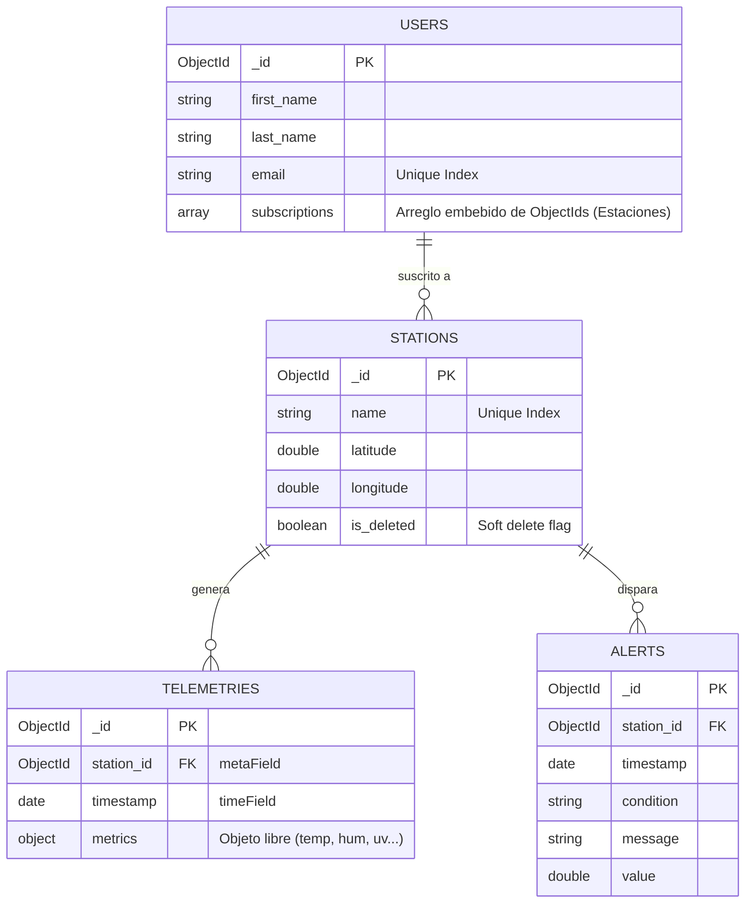

# Esquema de Base de Datos

WeatherFlow utiliza **MongoDB 6.0+** para maximizar el rendimiento de escritura y permitir esquemas dinámicos para el IoT. 

## Entity Relationship Diagram

## Colecciones y Optimización

- **`users` y `stations` (Relaciones Embedidas vs Referenciadas):**
  Las suscripciones se almacenan directamente embebidas como un Array dentro del documento del `user`, optimizando drásticamente la lectura de perfiles e invitando al Patrón Documento en lugar de tener tablas pivotantes N:M de SQL puras. Ambas colecciones poseen índices únicos a nivel BSON para prevenir *race conditions* de registro.

- **`telemetries` (MongoDB Time-Series):**
  A nivel de motor de BD, esta colección fue diseñada nativamente como Time-Series. Aprovecha estructuras tabulares en memoria para lograr ingestas de megabytes de datos por segundo. 
  * `timestamp` fue asignado como Time Field.
  * `station_id` fue asignado como Meta Field.
  
- **Consultas Relacionales (Left Joins):**
  A pesar de ser una base de datos NoSQL documental, el sistema requiere búsquedas relacionales (como buscar la telemetría cruzada con sus alertas). Para ello se utilizan `Aggregation Pipelines` mediante la etapa `$lookup`, combinando el `station_id` y `timestamp` como clave compuesta.
