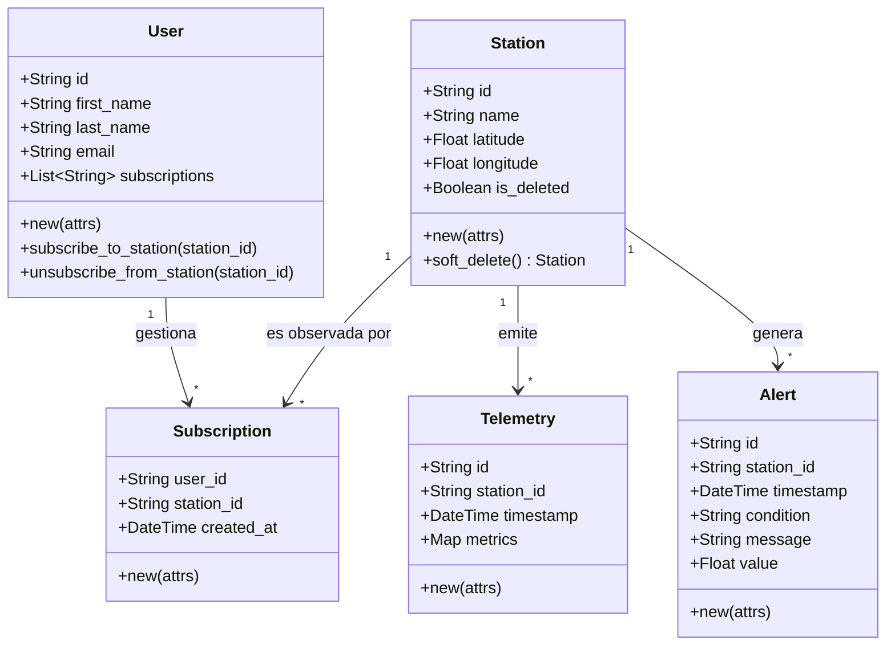

# Modelo de Dominio

En WeatherFlow, todos los modelos están construidos como *Structs* de Elixir y todas sus reglas de validación son funciones puras e inmutables.

## Diagrama UML de Clases

## Patrones Implementados
1. **Atributos Dinámicos en Telemetría:** El agregado `Telemetry` fue diseñado para recibir un diccionario arbitrario de variables (temperatura, radiación UV, humedad, lluvia, etc.). La invariante de negocio protege el ecosistema garantizando que todos sus valores internos sean siempre y estrictamente numéricos.
2. **Soft Deletes en Dominio:** La eliminación de estaciones no ocurre mágicamente en la BBDD, sino que la estación es alterada lógicamente en memoria (`Station.soft_delete/1`) haciendo mutar de forma pura su estado a `is_deleted: true`, lo que la capa de aplicación respeta antes de guardar y exponer datos al cliente.
3. **Factory Methods (`new/1`):** Todas las entidades forzan su validación paramétrica al intentar crearse mediante sus constructores explícitos.
